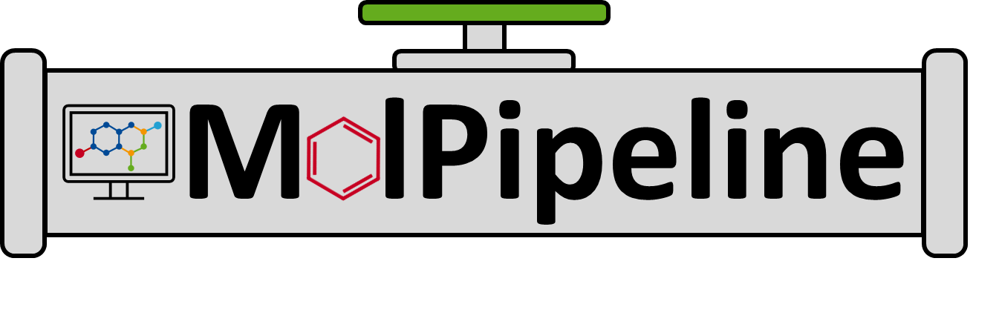

# MolPipeline
MolPipeline is a Python package for processing molecules with RDKit in scikit-learn.
<br/><br/>
<p align="center"></p>

## Background

The [scikit-learn](https://scikit-learn.org/) package provides a large variety of machine
learning algorithms and data processing tools, among which is the `Pipeline` class, allowing users to
prepend custom data processing steps to the machine learning model.
`MolPipeline` extends this concept to the field of cheminformatics by
wrapping standard [RDKit](https://www.rdkit.org/) functionality, such as reading and writing SMILES strings
or calculating molecular descriptors from a molecule-object.

MolPipeline aims to provide:

- Automated end-to-end processing from molecule data sets to deployable machine learning models.
- Scalable parallel processing and low memory usage through instance-based processing.
- Standard pipeline building blocks for flexibly building custom pipelines for various
cheminformatics tasks.
- Consistent error handling for tracking, logging, and replacing failed instances (e.g., a
SMILES string that could not be parsed correctly).
- Integrated and self-contained pipeline serialization for easy deployment and tracking
in version control.

## Publications

[Sieg J, Feldmann CW, Hemmerich J, Stork C, Sandfort F, Eiden P, and Mathea M, MolPipeline: A python package for processing
molecules with RDKit in scikit-learn, J. Chem. Inf. Model., doi:10.1021/acs.jcim.4c00863, 2024](https://doi.org/10.1021/acs.jcim.4c00863)
\
Further links: [arXiv](https://chemrxiv.org/engage/chemrxiv/article-details/661fec7f418a5379b00ae036)

[Feldmann CW, Sieg J, and Mathea M, Analysis of uncertainty of neural
fingerprint-based models, 2024](https://doi.org/10.1039/D4FD00095A)
\
Further links: [repository](https://github.com/basf/neural-fingerprint-uncertainty)

## Installation
```commandline
pip install molpipeline
```

## Documentation

The [notebooks](notebooks) folder contains many basic and advanced examples of how to use Molpipeline.

A nice introduction to the basic usage is in the [01_getting_started_with_molpipeline notebook](notebooks/01_getting_started_with_molpipeline.ipynb).

## Quick Start

### Model building

Create a fingerprint-based prediction model:
```python
from molpipeline import Pipeline
from molpipeline.any2mol import AutoToMol
from molpipeline.mol2any import MolToMorganFP
from molpipeline.mol2mol import (
    ElementFilter,
    SaltRemover,
)

from sklearn.ensemble import RandomForestRegressor

# set up pipeline
pipeline = Pipeline([
      ("auto2mol", AutoToMol()),                                     # reading molecules
      ("element_filter", ElementFilter()),                           # standardization
      ("salt_remover", SaltRemover()),                               # standardization
      ("morgan2_2048", MolToMorganFP(n_bits=2048, radius=2)),        # fingerprints and featurization
      ("RandomForestRegressor", RandomForestRegressor())             # machine learning model
    ],
    n_jobs=4)

# fit the pipeline
pipeline.fit(X=["CCCCCC", "c1ccccc1"], y=[0.2, 0.4])
# make predictions from SMILES strings
pipeline.predict(["CCC"])
# output: array([0.29])
```

### Feature calculation

Calculating molecular descriptors from SMILES strings is straightforward. For example, physicochemical properties can
be calculated like this:
```python
from molpipeline import Pipeline
from molpipeline.any2mol import AutoToMol
from molpipeline.mol2any import MolToRDKitPhysChem

pipeline_physchem = Pipeline(
    [
        ("auto2mol", AutoToMol()),
        (
            "physchem",
            MolToRDKitPhysChem(
                standardizer=None,
                descriptor_list=["HeavyAtomMolWt", "TPSA", "NumHAcceptors"],
            ),
        ),
    ],
    n_jobs=-1,
)
physchem_matrix = pipeline_physchem.transform(["CCCCCC", "c1ccccc1(O)"])
physchem_matrix
# output: array([[72.066,  0.   ,  0.   ],
#                [88.065, 20.23 ,  1.   ]])
```

MolPipeline provides further features and descriptors from RDKit, 
for example Morgan (binary/count) fingerprints and MACCS keys.
See the [04_feature_calculation notebook](notebooks/04_feature_calculation.ipynb) for more examples.

### Clustering

Molpipeline provides several clustering algorithms as sklearn-like estimators. For example, molecules can be
clustered by their Murcko scaffold. See the [02_scaffold_split_with_custom_estimators notebook](notebooks/02_scaffold_split_with_custom_estimators.ipynb) for scaffolds splits and further examples.

```python
from molpipeline.estimators import MurckoScaffoldClustering

scaffold_smiles = [
    "Nc1ccccc1",
    "Cc1cc(Oc2nccc(CCC)c2)ccc1",
    "c1ccccc1",
]
linear_smiles = ["CC", "CCC", "CCCN"]

# run the scaffold clustering
scaffold_clustering = MurckoScaffoldClustering(
    make_generic=False, linear_molecules_strategy="own_cluster", n_jobs=16
)
scaffold_clustering.fit_predict(scaffold_smiles + linear_smiles)
# output: array([1., 0., 1., 2., 2., 2.])
```


## License

This software is licensed under the MIT license. See the [LICENSE](LICENSE) file for details.
