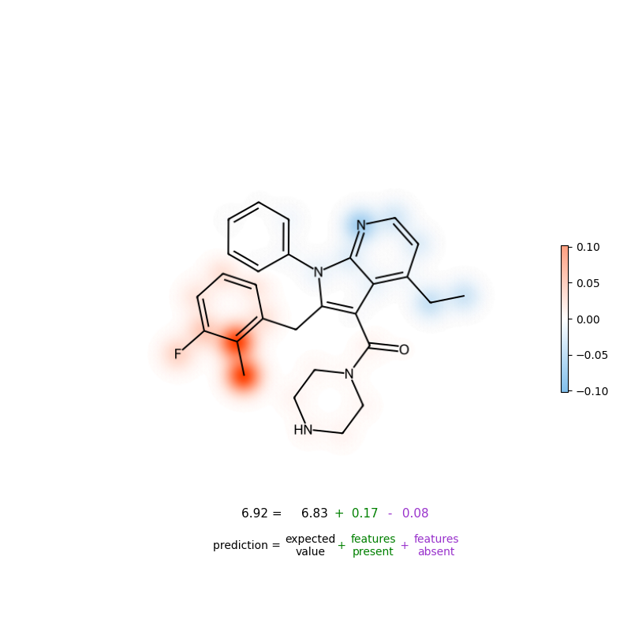

# MolPipeline
MolPipeline is a Python package for processing molecules with RDKit in scikit-learn.
<br/><br/>
<p align="center"></p>

## Background

The [scikit-learn](https://scikit-learn.org/) package provides a large variety of machine
learning algorithms and data processing tools, among which is the `Pipeline` class, allowing users to
prepend custom data processing steps to the machine learning model.
`MolPipeline` extends this concept to the field of cheminformatics by
wrapping standard [RDKit](https://www.rdkit.org/) functionality, such as reading and writing SMILES strings
or calculating molecular descriptors from a molecule-object.

MolPipeline aims to provide:

- Automated end-to-end processing from molecule data sets to deployable machine learning models.
- Scalable parallel processing and low memory usage through instance-based processing.
- Standard pipeline building blocks for flexibly building custom pipelines for various
cheminformatics tasks.
- Consistent error handling for tracking, logging, and replacing failed instances (e.g., a
SMILES string that could not be parsed correctly).
- Integrated and self-contained pipeline serialization for easy deployment and tracking
in version control.

## Publications

[Sieg J, Feldmann CW, Hemmerich J, Stork C, Sandfort F, Eiden P, and Mathea M, MolPipeline: A python package for processing
molecules with RDKit in scikit-learn, J. Chem. Inf. Model., doi:10.1021/acs.jcim.4c00863, 2024](https://doi.org/10.1021/acs.jcim.4c00863)
\
Further links: [arXiv](https://chemrxiv.org/engage/chemrxiv/article-details/661fec7f418a5379b00ae036)

[Feldmann CW, Sieg J, and Mathea M, Analysis of uncertainty of neural
fingerprint-based models, 2024](https://doi.org/10.1039/D4FD00095A)
\
Further links: [repository](https://github.com/basf/neural-fingerprint-uncertainty)

# Table of Contents

- [MolPipeline](#molpipeline)
  - [Background](#background)
  - [Publications](#publications)
- [Table of Contents](#table-of-contents)
  - [Installation](#installation)
  - [Documentation](#documentation)
  - [Quick start](#quick-start)
    - [Model building](#model-building)
    - [Feature calculation](#feature-calculation)
    - [Clustering](#clustering)
    - [Explainability](#explainability)
    - [Baseline machine learning models](#Baseline-machine-learning-models)
  - [License](#license)

## Installation
```commandline
pip install molpipeline
```

## Documentation

The [notebooks](notebooks) folder contains many basic and advanced examples of how to use Molpipeline.

A nice introduction to the basic usage is in the [01_getting_started_with_molpipeline notebook](notebooks/01_getting_started_with_molpipeline.ipynb).

## Quick Start

### Model building

Create a fingerprint-based prediction model:
```python
from molpipeline import Pipeline
from molpipeline.any2mol import AutoToMol
from molpipeline.mol2any import MolToMorganFP
from molpipeline.mol2mol import (
    ElementFilter,
    SaltRemover,
)

from sklearn.ensemble import RandomForestRegressor

# set up pipeline
pipeline = Pipeline([
      ("auto2mol", AutoToMol()),                                     # reading molecules
      ("element_filter", ElementFilter()),                           # standardization
      ("salt_remover", SaltRemover()),                               # standardization
      ("morgan2_2048", MolToMorganFP(n_bits=2048, radius=2)),        # fingerprints and featurization
      ("RandomForestRegressor", RandomForestRegressor())             # machine learning model
    ],
    n_jobs=4)

# fit the pipeline
pipeline.fit(X=["CCCCCC", "c1ccccc1"], y=[0.2, 0.4])
# make predictions from SMILES strings
pipeline.predict(["CCC"])
# output: array([0.29])
```

### Feature calculation

Calculating molecular descriptors from SMILES strings is straightforward. For example, physicochemical properties can
be calculated like this:
```python
from molpipeline import Pipeline
from molpipeline.any2mol import AutoToMol
from molpipeline.mol2any import MolToRDKitPhysChem

pipeline_physchem = Pipeline(
    [
        ("auto2mol", AutoToMol()),
        (
            "physchem",
            MolToRDKitPhysChem(
                standardizer=None,
                descriptor_list=["HeavyAtomMolWt", "TPSA", "NumHAcceptors"],
            ),
        ),
    ],
    n_jobs=-1,
)
physchem_matrix = pipeline_physchem.transform(["CCCCCC", "c1ccccc1(O)"])
physchem_matrix
# output: array([[72.066,  0.   ,  0.   ],
#                [88.065, 20.23 ,  1.   ]])
```

MolPipeline provides further features and descriptors from RDKit,
for example Morgan (binary/count) fingerprints and MACCS keys.
See the [04_feature_calculation notebook](notebooks/04_feature_calculation.ipynb) for more examples.

### Clustering

Molpipeline provides several clustering algorithms as sklearn-like estimators. For example, molecules can be
clustered by their Murcko scaffold. See the [02_scaffold_split_with_custom_estimators notebook](notebooks/02_scaffold_split_with_custom_estimators.ipynb) for scaffolds splits and further examples.

```python
from molpipeline.estimators import MurckoScaffoldClustering

scaffold_smiles = [
    "Nc1ccccc1",
    "Cc1cc(Oc2nccc(CCC)c2)ccc1",
    "c1ccccc1",
]
linear_smiles = ["CC", "CCC", "CCCN"]

# run the scaffold clustering
scaffold_clustering = MurckoScaffoldClustering(
    make_generic=False, linear_molecules_strategy="own_cluster", n_jobs=16
)
scaffold_clustering.fit_predict(scaffold_smiles + linear_smiles)
# output: array([1., 0., 1., 2., 2., 2.])
```


### Explainability

Machine learning model pipelines can be explained using the `explainability` module. MolPipeline uses the
[SHAP](https://github.com/shap/shap) library to compute Shapley values for explanations. The Shapley Values can be
mapped to the molecular structure to visualize the importance of atoms for the prediction.

<p align="center"></p>

[advanced_03_introduction_to_explainable_ai notebook](notebooks/advanced_03_introduction_to_explainable_ai.ipynb)
<a target="_blank" href="https://colab.research.google.com/github/basf/MolPipeline/blob/main/notebooks/advanced_03_introduction_to_explainable_ai.ipynb">
  
</a>
gives a detailed introduction to explainability. The notebook also compares explanations of Tree-based models to Neural Networks
using the structure-activity relationship (SAR) data from [Harren et al. 2022](https://pubs.acs.org/doi/10.1021/acs.jcim.1c01263).

Use the following example code to explain a model's predictions and visualize the explanation as heatmaps.

```python
from molpipeline import Pipeline
from molpipeline.any2mol import AutoToMol
from molpipeline.mol2any import MolToMorganFP
from molpipeline.experimental.explainability import SHAPTreeExplainer
from molpipeline.experimental.explainability import (
    structure_heatmap_shap,
)
from sklearn.ensemble import RandomForestRegressor

X = ["CCCCCC", "c1ccccc1"]
y = [0.2, 0.4]

pipeline = Pipeline([
    ("auto2mol", AutoToMol()),
    ("morgan2_2048", MolToMorganFP(n_bits=2048, radius=2)),
    ("RandomForest", RandomForestRegressor())
],
    n_jobs=4)
pipeline.fit(X, y)

# explain the model
explainer = SHAPTreeExplainer(pipeline)
explanations = explainer.explain(X)

# visualize the explanation
image = structure_heatmap_shap(explanation=explanations[0])
image.save("explanation.png")

```
Note that the explainability module is fully-functional but in the 'experimental' directory because we might make changes to the API.

### Baseline machine learning models

MolPipeline provides improved configurations for common baseline models for molecular property prediction, such as
Random Forest.
Based on practical experience, these often perform better than simply using scikit-learn’s default settings and binary
Morgan fingerprints. In addition, our Random Forest baseline was part of CheMeleon's benchmark experiments,
where it performs much better than the simple configuration on the Polaris and MoleculeACE benchmarks; see the paper
[Deep Learning Foundation Models from Classical Molecular Descriptors](https://arxiv.org/abs/2506.15792) and
[repository](https://github.com/JacksonBurns/CheMeleon).

There is a convenient function to get a Random Forest baseline model as a Pipeline:

```python
from molpipeline.predefined_pipelines import (
    get_rf_regressor_baseline,
)

# get the RandomForestRegressor baseline as a Pipeline
rf_baseline = get_rf_regressor_baseline(n_jobs=16, random_state=42)
# For classification tasks, use get_rf_classifier_baseline instead

X = ["CCCCCC", "c1ccccc1"]
y = [0.2, 0.4]

rf_baseline.fit(X, y)
preds = rf_baseline.predict(X)
# output: [0.2468   0.3428]

# Optionally, set `error_handling=True` to enable automated error handling to gracefully
# set predictions to NaN for invalid and failing molecules
rf_baseline = get_rf_regressor_baseline(n_jobs=16, random_state=42, error_handling=True)
# For classification tasks, use get_rf_classifier_baseline instead

X = ["CCCCCC", "bad_smiles", "c1ccccc1"]
y = [0.2, 0.1, 0.4]

rf_baseline.fit(X, y)
preds = rf_baseline.predict(X)
# output: array([0.2468    nan 0.3428])

```

The Random Forest baseline models differ to the model with scikit-learn defaults and binary fingerprints in the following ways:
- Use `n_estimators=500` instead of sklearn's default `n_estimators=100`.
- Use Morgan **count** fingerprint instead of commonly used **binary** fingerprint.
- Concatenate Morgan count fingerprints with RDKit's physiochemical (PhysChem) descriptors, which
  ofter work orthogonally to fingerprints.
- Based on our experience, minimal hyperparameter tuning of Random Forests's `max_features`
  can (slightly) improve and significantly speed up training.
  In this configuration, we set: `max_features="log2"`.

Here is the pipeline definition code for the RandomForestClassifier baseline:

```python
from sklearn.ensemble import RandomForestClassifier
from sklearn.feature_selection import VarianceThreshold

from molpipeline import Pipeline
from molpipeline.any2mol import AutoToMol
from molpipeline.mol2any import (
    MolToConcatenatedVector,
    MolToMorganFP,
    MolToRDKitPhysChem,
)

random_state = 42
n_jobs = 16
pipe_baseline = Pipeline(
    [
        ("auto2mol", AutoToMol()),  # reading molecules
        (
            "morgan_physchem",
            MolToConcatenatedVector(
                [
                    (
                        "RDKitPhysChem",
                        MolToRDKitPhysChem(
                            standardizer=None,  # we avoid standardization at this point
                        ),
                    ),
                    (
                        "MorganFP",
                        MolToMorganFP(
                            n_bits=2048,
                            radius=2,
                            return_as="dense",
                            counted=True,
                        ),
                    ),
                ],
            ),
        ),
        # remove zero-variance features. Usually, doesn't really improve accuracy
        # but makes training faster.
        ("variance_filter", VarianceThreshold(0.0)),
        (
            "model",
            RandomForestClassifier(
                n_estimators=500,
                random_state=random_state,
                n_jobs=n_jobs,
                max_features="log2",
            ),
        ),
    ],
    n_jobs=n_jobs,
)
```

The code for `RandomForestRegressor` looks the same but uses `RandomForestRegressor` instead of `RandomForestClassifier`.
The code for automated error handling is omitted for clarity.


## License

This software is licensed under the MIT license. See the [LICENSE](LICENSE) file for details.
